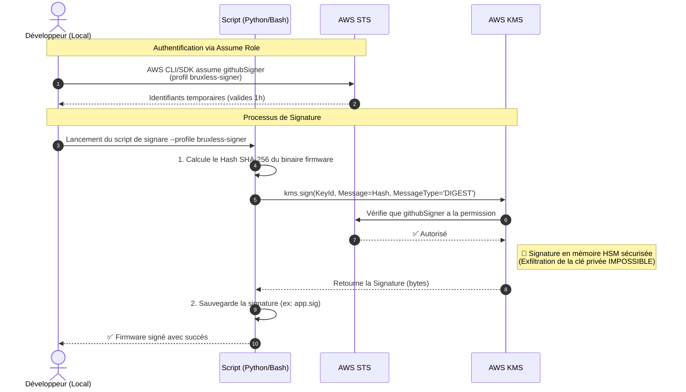

# Guide Développeur : Signature de Firmware via AWS KMS

Ce document explique comment un développeur autorisé peut signer un firmware localement sur sa machine, en utilisant la délégation de rôle AWS (`githubSigner`), tout en garantissant qu'aucune clé privée ne se trouve sur son disque dur.

## Pré-requis

1. Vous devez disposer d'un compte AWS configuré localement (`~/.aws/credentials`).
2. Vous devez avoir récupéré votre ARN AWS IAM :

   ```bash
   aws sts get-caller-identity
   # Cherchez la valeur "Arn", ex: arn:aws:iam::123456789012:user/votre.nom
   ```

3. L'administrateur Cloud doit avoir ajouté cet ARN à la liste des identifiants autorisés (Trust Policy) dans AWS. (Voir le Guide Administrateur).

## Configuration Initiale du Profil (Une Seule Fois)

Afin d'endosser dynamiquement le rôle autorisé à lancer une opération de signature (sans avoir à utiliser des variables d'environnement compliquées), AWS supporte nativement la création d'un "profil délégué".

Ouvrez le fichier `~/.aws/config` (et non `credentials`) et ajoutez ces lignes :

```ini
[profile bruxless-signer]
role_arn = arn:aws:iam::123456789012:role/githubSigner
source_profile = default
region = eu-west-3
```

- Remplacez **`123456789012`** par l'ID de compte AWS que l'administrateur vous aura fourni.
- Adaptez `source_profile` avec le nom du profile que vous utilisez d'habitude pour vous connecter à AWS (le profil contenant vos credentials permanents), si ce n'est pas `default`.

## Signature du Firmware au quotidien

Lorsque la configuration est en place et que votre ARN a bien été autorisé, le profil basculera les rôles automatiquement tout en limitant les privilèges uniquement aux actes de signature pendant `1 Heure`.



### Exemple avec AWS CLI depuis un script Python (ou autre SDK)

Si vous disposez d'un script `sign_firmware_aws.py` :

```bash
# Exportez le bon profil local avant le lancement de votre script
export AWS_PROFILE=bruxless-signer

# Le SDK s'authentifiera automatiquement auprès d'AWS IAM pour générer un jeton temporaire depuis votre compte
python3 ./sign_firmware_aws.py \
  --key-id alias/sec/firmware-signer \
  --firmware firmware-build.bin \
  --region eu-west-3
```

L'unique moyen d'obtenir une signature valide au format convenu (pour le Bootloader) et donc avec ces identifiants cryptographiques sécurisés, est de passer par votre identité AWS. La compromission du PC d'un développeur ne peut en aucun cas faire fuir la clé "maître".
