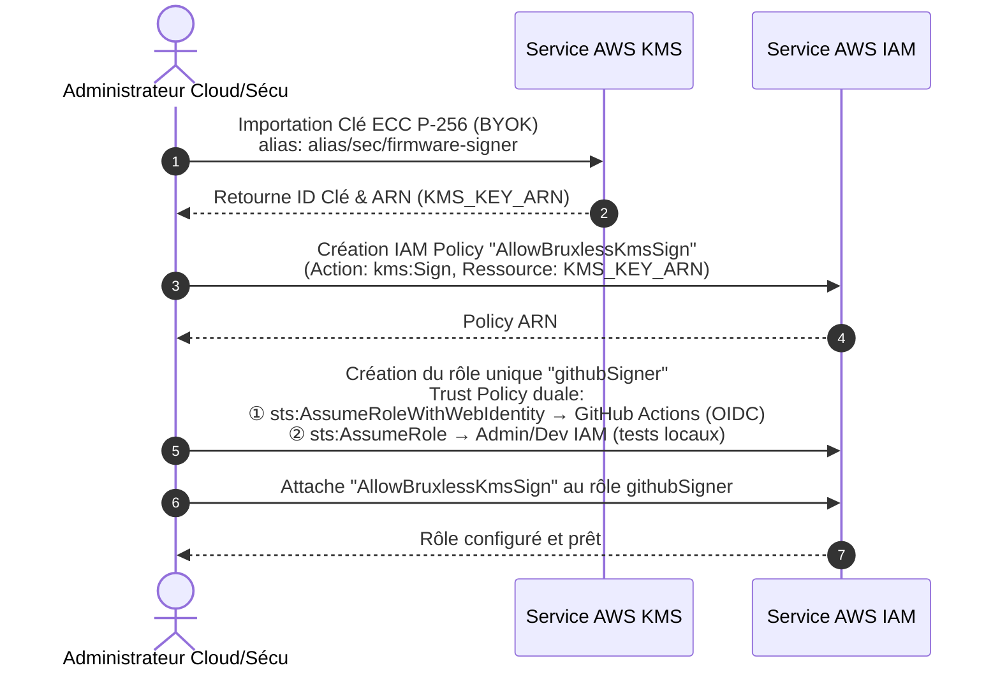
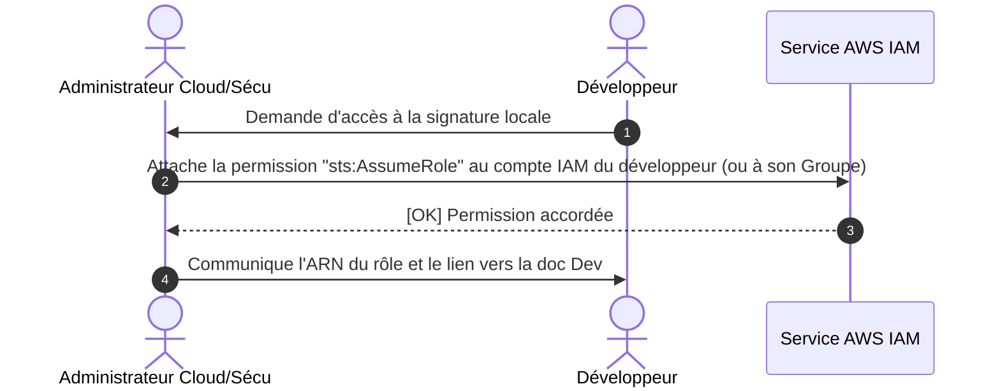
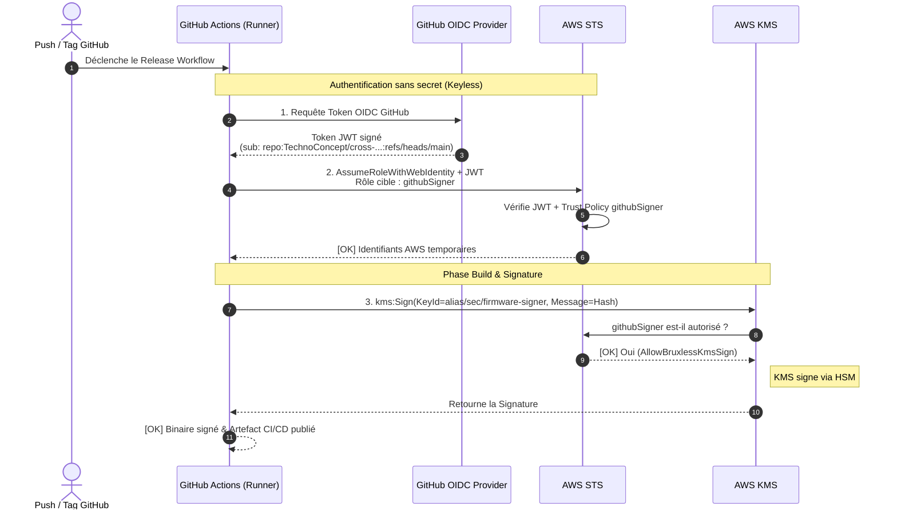

# Guide Administrateur : Paramétrage Sécurité AWS KMS

Ce document décrit pas à pas comment un administrateur Cloud ou Sécurité met en place la solution "Bring Your Own Key" (BYOK) dans AWS KMS pour signer les firmwares de manière sécurisée.

## Architecture

L'architecture repose sur un seul rôle IAM (`githubSigner`), assumé par les GitHub Actions via OIDC (pour l'intégration et le déploiement continu) et par les développeurs autorisés localement via leur compte AWS.



**Légende :**
1. L'administrateur importe la clé ECC (BYOK) dans KMS et obtient un ID/ARN.
2. L'administrateur crée une politique IAM (`AllowBruxlessKmsSign`) autorisant l'utilisation de cette clé KMS spécifique.
3. AWS IAM confirme la création de la politique.
4. L'administrateur crée le rôle `githubSigner` avec une Trust Policy permettant l'utilisation par GitHub (OIDC) et par les admins/dévs locaux (AssumeRole).
5. La politique créée à l'étape 2 est attachée au rôle `githubSigner`.
6. La configuration IAM/KMS est finalisée.

## Étape 1 : Générer une clé de signature

Une clé ECC SECP256R1 (P-256) doit être générée sur une machine sécurisée.

1.  **Générer la paire clé privée/clé publique (PEM)** :
    ```bash
    ./generate-keys.sh
    # Cela génère private_key.pem et public_key.pem
    ```

2.  **Convertir la clé au format binaire (DER)** :
    Le matériel de clé doit être au format DER pour être importé dans AWS KMS. Utilisez le script de conversion :
    ```bash
    ./pem-to-der.sh
    # Cela génère private_key.der
    ```

> [!WARNING]
> Sauvegardez `private_key.pem` et `private_key.der` dans un système de gestion de secrets (comme Bitwarden ou Vault) puis supprimez-les de votre machine. Ces fichiers ne pourront plus être modifiés une fois importés et AWS ne vous redonnera jamais la clé privée.

## Étape 2 : Importer la clé dans AWS KMS

Exécutez le script d'import avec un profil AWS disposant des droits administratifs. Ce script :

- Crée une "Master Key AWS" sans matériel de chiffrement.
- Récupère le certificat d'enveloppement (Wrapping Key).
- Chiffre votre `private_key.der` en transit.
- L'injecte de manière sécurisée, puis crée un alias pour cette clé.

> [!NOTE]
> Si vous souhaitez modifier le nom des fichiers ou l'alias, vous pouvez éditer la section CONFIGURATION au début du fichier `import-key-into-aws.sh`. Attention, l'alias choisi devra être rigoureusement le même dans `create-or-update-kms-sign-policy.sh` et `create-or-update-github-signer-role.sh`.

```bash
export AWS_PROFILE=bruxless-admin
export AWS_REGION=eu-west-3

./import-key-into-aws.sh
```

## Étape 3 : Créer les permissions et le rôle GitHub

La configuration est désormais séparée en deux scripts pour plus de clarté et de sécurité.

1. **Création de la Policy IAM (`AllowBruxlessKmsSign`) :**
   Ce script crée la policy qui donne le droit d'utiliser l'alias KMS.
   ```bash
   ./create-or-update-kms-sign-policy.sh
   ```

2. **Création du Rôle IAM (`githubSigner`) et de l'OIDC :**
   Ce script crée le fournisseur OIDC (pour GitHub) et le rôle `githubSigner`. 
   Vous pouvez configurer les dépôts autorisés en éditant la variable `GITHUB_REPOS` dans le script `create-or-update-github-signer-role.sh` avant de l'exécuter.
   ```bash
   ./create-or-update-github-signer-role.sh
   ```

## Étape 4 : Ajouter un Développeur à postériori

Le rôle `githubSigner` intègre désormais la délégation de compte AWS ("Account Trust Delegation"). Vous n'avez plus besoin de modifier le script ni la *Trust Policy* du rôle pour ajouter un développeur.

1. **Via la Console AWS ou Terraform :** Allez sur l'utilisateur IAM du développeur (ou mieux, un Groupe IAM de développeurs).
2. **Attachez cette policy *inline* ou gérée :**
   ```json
   {
       "Version": "2012-10-17",
       "Statement": [
           {
               "Sid": "AllowAssumeGithubSignerRole",
               "Effect": "Allow",
               "Action": "sts:AssumeRole",
               "Resource": "arn:aws:iam::VOTRE_NUMERO_DE_COMPTE:role/githubSigner"
           }
       ]
   }
   ```
3. Orientez le développeur vers le fichier `aws-kms-developer-guide.md` afin qu'il puisse configurer ses AWS Credentials (`~/.aws/credentials` et `~/.aws/config`).



**Légende :**
1. Le développeur (ou système) demande la capacité de signer un firmware en local.
2. L'administrateur Cloud accorde la permission d'assumer le rôle `githubSigner` directement sur le compte IAM du développeur.
3. IAM confirme l'ajout de la permission "Account Trust Delegation".
4. L'administrateur transmet les informations et la documentation au développeur.

## Étape 5 : GitHub Actions (CI/CD Automatisation)

Une fois installé, le pipeline CI/CD n'aura besoin d'aucun mot de passe secret AWS statique.
GitHub échangera un jeton de courte durée contre des droits de signature.



**Légende :**
1. Un événement GitHub automatique (ex: tag) déclenche le runner d'intégration continue.
2. Le workflow demande un jeton temporaire (Token OIDC) en prouvant l'identité du repository et de la branche concernée.
3. GitHub OIDC retourne le jeton Web JWT signé.
4. Le Runner présente le JWT à AWS STS pour demander l'accès au rôle cible `githubSigner`.
5. AWS vérifie la signature du jeton OIDC par rapport aux dépôts autorisés dans la Trust Policy du rôle.
6. AWS retourne des identifiants (Session Token) temporaires et très limités dans le temps pour l'exécution d'actions dans le compte.
7. Le workflow transmet alors le condensat (Hash) du firmware au service KMS pour qu'il soit signé avec la clé asymétrique sécurisée.
8. AWS KMS valide que le rôle a bien la policy `AllowBruxlessKmsSign` qui l'autorise à le faire.
9. AWS approuve l'utilisation.
10. L'opération a lieu complètement isolée au sein de AWS HSM (Hardware Security Module), générant la signature sans exposer la clé privée.
11. La signature finie est renvoyée au Runner.
12. Le pipeline rattache la signature au build et publie le correctif signé sur GitHub.
