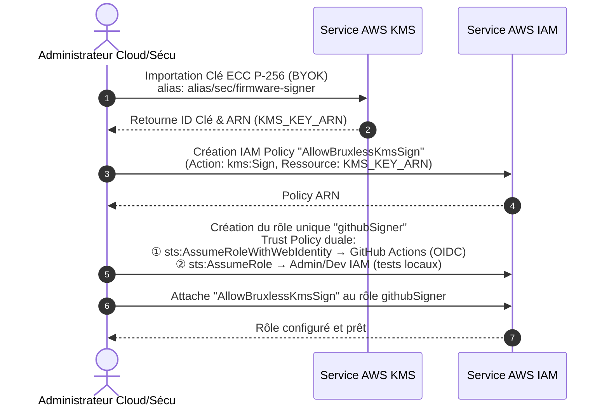
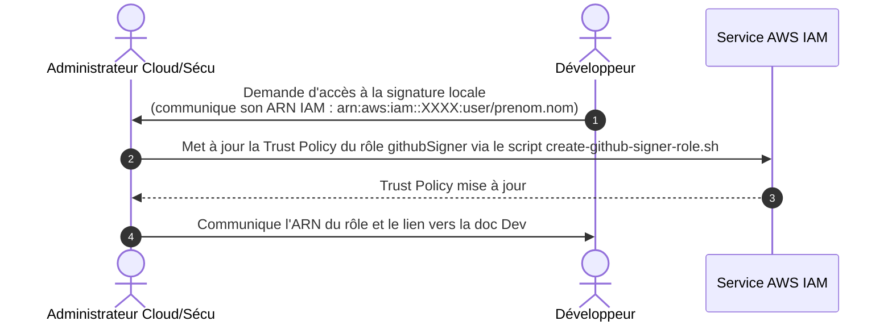
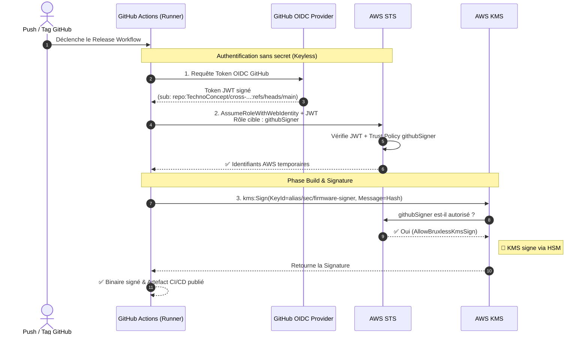

# Guide Administrateur : Paramétrage Sécurité AWS KMS

Ce document décrit pas à pas comment un administrateur Cloud ou Sécurité met en place la solution "Bring Your Own Key" (BYOK) dans AWS KMS pour signer les firmwares de manière sécurisée.

## Architecture

L'architecture repose sur un seul rôle IAM (`githubSigner`), assumé par les GitHub Actions via OIDC (pour l'intégration et le déploiement continu) et par les développeurs autorisés localement via leur compte AWS.



## Étape 1 : Générer une clé de signature

Une clé ECC SECP256R1 (P-256) doit être générée sur une machine sécurisée et déconnectée d'Internet si possible.

Utilisez le script `generate-private-key.sh` :

```bash
# Génère par défaut private_key.der
./generate-private-key.sh

# Pour extraire la clé publique à fournir au firmware (bootloader) :
openssl ec -inform DER -in private_key.der -pubout -outform DER -out public_key.der
```

⚠️  **Sauvegardez `private_key.der` dans un système de gestion de secrets (comme Bitwarden/Vault) et supprimez-le de votre machine.** Il ne sera plus modifiable une fois importé et AWS ne le renverra jamais.

## Étape 2 : Importer la clé dans AWS KMS

Exécutez le script d'import avec un profil AWS disposant des droits administratifs. Ce script :

- Crée une "Master Key AWS" sans matériel de chiffrement.
- Récupère le certificat d'enveloppement (Wrapping Key).
- Chiffre votre `private_key.der` en transit.
- L'injecte sécuritairement, puis crée un alias pour cette clé.

➡️  Si vous souhaitez modifier le nom des fichiers ou l'alias, vous pouvez **éditer la section CONFIGURATION** au début du fichier `import-key-into-aws.sh`. **Attention**, l'alias choisi devra être rigoureusement le même dans `create-github-signer-role.sh`.

```bash
export AWS_PROFILE=bruxless-admin
export AWS_REGION=eu-west-3

./import-key-into-aws.sh
```

## Étape 3 : Créer les permissions et le rôle GitHub

Le script `create-github-signer-role.sh` va automatiser la création du fournisseur OIDC GitHub, de la politique de sécurité liant l'alias KMS créé ci-dessus, et du rôle `githubSigner`.

1. **Ouvrez `create-github-signer-role.sh`** dans votre éditeur de texte.
2. Modifiez la section **CONFIGURATION** en haut du fichier :
   - Ajoutez ou supprimez des dépôts GitHub autorisés dans le tableau `GITHUB_REPOS`.
   - Ajoutez les ARN des comptes développeurs dans le tableau `DEVELOPER_ARNS`.
3. **Exécutez le script** :

```bash
./create-github-signer-role.sh
```

## Étape 4 : Ajouter un Développeur à postériori

La gestion par OIDC/IAM n'utilise pas de mot de passe ni de "secret d'API longue durée". Si vous devez rajouter un nouvel employé :

1. Récupérez son ARN IAM (par exemple `arn:aws:iam::123456789012:user/prenom.nom`).
2. Ajoutez cette chaîne au tableau `DEVELOPER_ARNS` au début de `create-github-signer-role.sh`.
3. Ré-exécutez `./create-github-signer-role.sh`. Le script mettra à jour la *Trust Policy* IAM existante sans rien casser.
4. Orientez le développeur vers le fichier `aws-kms-developer-guide.md` afin qu'il puisse configurer son environnement de dev local.



## Étape 5 : GitHub Actions (CI/CD Automatisation)

Une fois installé, le pipeline CI/CD n'aura besoin d'aucun mot de passe secret AWS statique.
GitHub échangera un jeton de courte durée contre des droits de signature.


